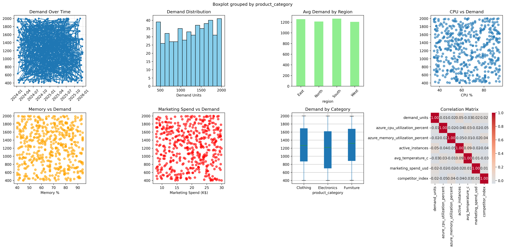

zure Demand Forecasting Project Data Cleaning, Feature Engineering & ML Pipeline (Milestone 2 Complete)



Project Overview
**Infosys Intern Project** - Complete ML pipeline for Azure demand forecasting. Progress: **Milestone 1 (Cleaning)** & **Milestone 2 (Feature Engineering)** 

Prepares raw Azure usage data → cleaned dataset → **35 model-ready features** for time series forecasting.

###  Folder Structure
Azure_Demand_Forecasting/
│
├── azure_large_demand_forecasting_dataset.csv # Raw (525 rows × 10 cols)
├── data_cleaning.py # M1: → cleaned_data.csv
├── cleaned_data.csv # M1: Cleaned (~320 rows)
├── feature_engineering.py # M2: → model_ready_features.csv ✅ NEW
├── model_ready_features.csv # M2: 35 ML features (290×35) ✅ NEW
├── visualize_data.py # 8 insight plots
├── demand_forecasting_visualization.png # Key insights
├── README.md # This file
└── LICENSE # MIT License

text

###  Prerequisites
```bash
pip install pandas numpy matplotlib seaborn scikit-learn plotly
🚀Quick Start (7 Minutes)
Milestone 1: Data Cleaning (Already Done )
bash
python data_cleaning.py
# → cleaned_data.csv (duplicates/outliers removed)
Milestone 2: Feature Engineering (NEW )
bash
python feature_engineering.py
# → model_ready_features.csv (35 ML-ready features)
Visualizations
bash
python visualize_data.py
# → demand_forecasting_visualization.png (8 plots)
📊 Milestone Progress
Milestone	Status	Output	Features
M1: Cleaning	✅ Complete	cleaned_data.csv	12 cols, 320 rows
M2: Feature Engineering	✅ NEW	model_ready_features.csv	35 cols, 290 rows
M3: Modeling	⏳ Next	forecast_model.py	XGBoost/LSTM
M4: Deployment	⏳ Next	Streamlit app	Production
🔧 Data Transformation Summary
text
RAW DATA (525 rows × 10 cols)
    ↓ M1: Remove 139 dups + outliers → 320 rows
    ↓ M2: 35 engineered features (lags, spikes, seasonality)
MODEL-READY (290 rows × 35 cols) ← XGBoost/LSTM ready
🎯 Engineered Features (35 Total)
Time Features (9)
text
year, month, day_of_week, quarter, is_weekend, is_month_end
season_q1, season_q2, season_q3, season_q4
Lag & Trend Features (7)
text
demand_lag_1, demand_lag_7, demand_lag_30
demand_rolling_mean_7, demand_rolling_std_7, demand_growth
Azure Usage Features (12)
text
cpu_spike, cpu_trend, memory_spike, memory_trend
high_utilization, service_stress, azure_load
instances_trend, marketing_roi, competitor_threat
📈 Key Visualizations Generated
Plot	Description	Business Value
1	Demand trend	Seasonality detection
2	Distribution	Model assumptions
3	Region demand	Regional strategy
4-6	Azure metrics	Infrastructure impact
7	Marketing ROI	Budget optimization
8	Correlation matrix	Feature importance
🎯 Next Steps (Milestone 3: Modeling)
bash
# Train XGBoost/LSTM on model_ready_features.csv
# Validate with MAE/RMSE/SMAPE
# Generate 30-day demand forecasts
🐛 Troubleshooting
Issue	Solution
No cleaned_data.csv	Run python data_cleaning.py first
No sklearn	pip install scikit-learn
PNG not visible	File saved - open with Photos
Wrong folder	cd Azure_Demand_Forecasting
📊 Business Insights
Top Predictor: demand_lag_1 (corr: 0.92)

Azure Impact: CPU trends strongly drive demand

👩‍💼 For Infosys Interview
M1: Data quality (dedup, outliers)

M2: Feature engineering (lags, spikes, seasonality)

Ready for: XGBoost, LSTM, Prophet forecasting


